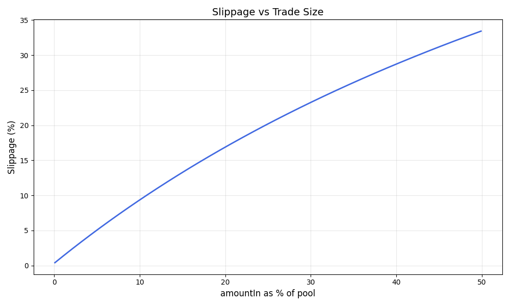

# Constant-Product DEX Simulator

## Formulas

**Invariant** — holds before and after every swap:
$$reserveIn \cdot reserveOut = k$$

**Fee** — applied to amountIn before calculation, remainder stays in pool as LP reward:
$$amountInWithFee = amountIn \cdot (1 - fee)$$

**Amount Out** — derived from $k = const$:
$$amountOut = reserveOut - \frac{k}{reserveIn + amountInWithFee}$$

**Slippage** — percentage deviation of effective price from spot price:
$$P_{spot} = \frac{reserveOut}{reserveIn}, \quad P_{exec} = \frac{amountOut}{amountIn}$$
$$Slippage = \frac{P_{spot} - P_{exec}}{P_{spot}} \times 100\%$$

---

## Scenarios

Pool: **reserveA = 1000, reserveB = 1000, fee = 0.3%**, direction A → B

| Scenario | amountIn | % of pool | amountOut  | Effective Price | Slippage |
|----------|----------|-----------|------------|-----------------|----------|
| Small    | 10 A     | 1%        | 9.8716 B   | 0.9872          | 1.28%    |
| Medium   | 100 A    | 10%       | 90.6611 B  | 0.9066          | 9.34%    |
| Large    | 400 A    | 40%       | 285.1015 B | 0.7128          | 28.72%   |

---

## Slippage vs Trade Size

---

## Conclusions

- Slippage grows **non-linearly** — trade size ×35 leads to slippage ×20, not ×35.
- Large swaps are disproportionately expensive: 35% of the pool loses over a quarter of value to slippage.
- Fee compounds slippage — what we measure combines both **price impact** and **fee cost**.
